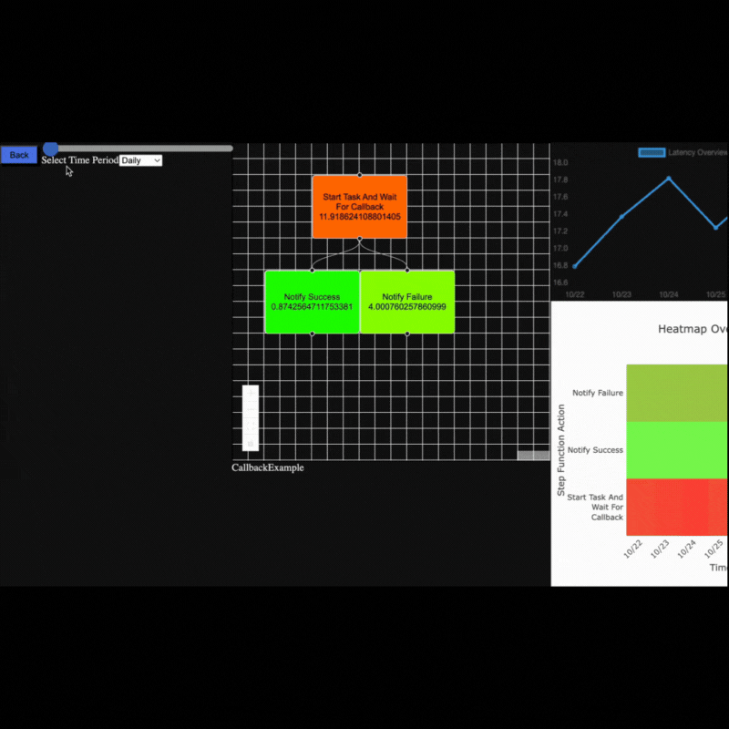
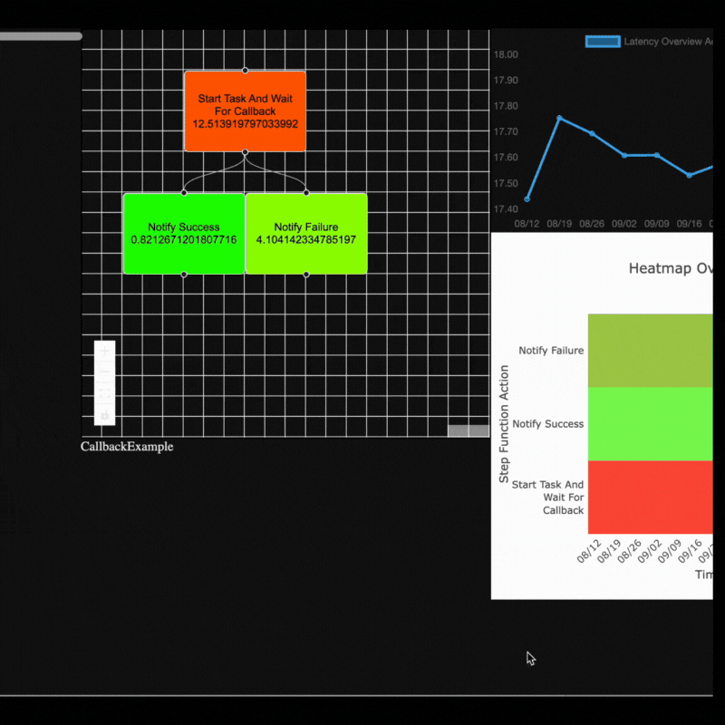

# TimeClimb 

TimeClimb is an app that visualizes AWS Step Function latency averages over custom time ranges (day, week, month, or year), displaying overall step function and individual step latencies. Users can view line charts for time-based latency trends and click on individual steps to see detailed latency metrics on a line chart. A heat map displaying each step's latencies over the selected period of time will display by default.

## Features


### Demonstrations 
## Select desired hour, day, week or month
<p>Use slider to view latencies at a specific hour, day, week or month.</p>
<p>
</p>

## View individual step latency averages as chart
<p>To view the latency averages for each indivual action (step) as a chart, click on desired action.
</p>
<p>

</p>

## Setup
#### More detailed setup information on each step can be found in database/knex-migration-usage.md


  ### 1. Insert environment variables to example.env file
  ```json
          PGHOST='localhost'
          PGPORT='5432'
          PGUSER='yourUserName'
          PGPASSWORD='yourPassword'  
  ```
  ### 2. Important AWS Information
  To use this application, a user must be granted certain permissions. Permissions are defined by policies attached to the user directly or through groups in AWS. The following permissions must be granted:
  <ol>
  <li> To pull state machine information from AWS: DescribeStateMachine</li>
  <li> To retrieve execution log data for each step function: read access to FilterLogEvents</li>
  </ol>

  ### 3. Insert AWS Access Key and Secret Access Key ###
  ```json
          AWS_ACCESS_KEY_ID=yourAcessKey
          AWS_SECRET_ACCESS_KEY=yourSecretAccessKey
  ```

# Contribution Information

## Installation and set up for contribution
<details>
<summary>1. Insert environment variables to example.env file</summary>

#### Note: Be sure this file is added to your gitignore
Example:
```json
          PGHOST='localhost'
          PGPORT='5432'
          PGUSER='yourUserName'
          PGPASSWORD='yourPassword'  
```
</details>

<details>
<summary>
 2. Insert AWS Access Key and Secret Access Key
</summary>

#### Note: Be sure this file is added to your gitignore

Example:
  ```json
          AWS_ACCESS_KEY_ID=yourAcessKey
          AWS_SECRET_ACCESS_KEY=yourSecretAccessKey
  ```

</details>

<details>
<summary>
 3. Seed dummy data into database
</summary>

#### Note: 
These migrations will happen through Knex Library https://knexjs.org/. This library will also be used for queries made to database in models.

#### Note: 
If you do not already have PostgresQL on your machine, you will need to download it.

</details>


## API Documentation
## Base URL
### **`http://localhost:3000/api`**

All API requests are be made to http://localhost:3000/api

## Endpoints

### To retrieve **Step Functions** from database

<details>
<summary>
<code>GET</code><code>/</code>Gets all step functions previously stored in the database
</summary>

#### Parameters

> None

#### Responses
> | http code | content-type                     | response |
> | --------- | -------------------------------- | -------- |
> | `200`     | `application/json;charset=UTF-8` | JSON     |

#### Example Status Code for 200 Ok

```json
[
  {
    "step_function_id": 0,
    "name": "string",
    "description": "string",
    "definition": {}
  }
]
```
</details>

<details>

<summary>
<code>POST</code><code>/step_functions/addStepFunction</code>
<code>Adds a step function to the database</code>
</summary>


#### Parameters

> | name | type     | data type | description                                          |
> | ---- | -------- | --------- | ---------------------------------------------------- |
> | body | required | object    | the arn that corresponds to a specific state machine | |

#### Example Body - JSON

```json
{ "arn": "arn:partition:service:region:account-id:resource-type:resource-id" }
```

### Responses

> | http code | content-type                     | response |
> | --------- | -------------------------------- | -------- |
> | `200`     | `application/json;charset=UTF-8` | JSON     |
> | `400`     | `application/json;charset=UTF-8` | JSON     |
> | `401`     | `application/json;charset=UTF-8` | JSON     |

#### Example Response for 200 Ok: Returns the newly added step function

```json
{
  "step_function_id": 0,
  "name": "string",
  "definition": {}
}
```

</details>
<details>
<summary>
<code>GET</code><code>/step_functions/:step_functions_id/hours</code>
<code>Retrieves <b>hourly</b> average latencies over a span of one <b>day</b> in ascending order</code>
</summary>

#### Parameters

> | name                    | type     | data type |  description                             |
> | ------------------------| -------- | --------- | ---------------------------------------- |
> | `path.step_function_id` | required | string    | The unique ID associated with this step function in database passed in the URL path (`/:step_function_id/hours`) |

#### Example Request
localhost:3000/api/average-latencies/:step_function_id/hours

### Responses

> | http code | content-type                     | response |
> | --------- | -------------------------------- | -------- |
> | `200`     | `application/json;charset=UTF-8` | JSON     |

#### Example Response for 200 Ok
##### Note: If a step function's latencies are not found in database, the elements value in the response will be an empty object
```json
[
 {
        "date": "2024-10-23T04:00:00.000Z",
        "stepFunctionAverageLatency": 18.144353388646543,
        "steps": {
            "Start Task And Wait For Callback": {
                "average": 14.44404914949289
            },
            "Notify Success": {
                "average": 0.6627415526268704
            },
            "Notify Failure": {
                "average": 3.037562686526782
            }
        }
    }
]
```

</details>
<details>
<summary>
<code>GET</code><code>/step_functions/:step_functions_id/days</code>
<code>Retrieves <b>daily</b> average latencies over a span of 7 <b>days</b> in ascending order</code>
</summary>

#### Parameters

> | name                    | type     | data type |  description                             |
> | ------------------------| -------- | --------- | ---------------------------------------- |
> | `path.step_function_id` | required | string    | The unique ID associated with this step function in database passed in the URL path (`/:step_function_id/days`) |

#### Example Request
localhost:3000/api/average-latencies/:step_function_id/days

### Responses

> | http code | content-type                     | response |
> | --------- | -------------------------------- | -------- |
> | `200`     | `application/json;charset=UTF-8` | JSON     |

#### Example Response for 200 Ok
##### Note: If a step function's latencies are not found in database, the elements value in the response will be an empty object
```json
[
 {
        "date": "2024-10-23T04:00:00.000Z",
        "stepFunctionAverageLatency": 18.144353388646543,
        "steps": {
            "Start Task And Wait For Callback": {
                "average": 14.44404914949289
            },
            "Notify Success": {
                "average": 0.6627415526268704
            },
            "Notify Failure": {
                "average": 3.037562686526782
            }
        }
    }
]
```
</details>
<details>
<summary>
<code>GET</code><code>/step_functions/:step_functions_id/weeks</code>
<code>Retrieves <b>weekly</b> average latencies over a span of 12 <b>weeks</b> in ascending order</code>
</summary>

#### Parameters

> | name                    | type     | data type |  description                             |
> | ------------------------| -------- | --------- | ---------------------------------------- |
> | `path.step_function_id` | required | string    | The unique ID associated with this step function in database passed in the URL path (`/:step_function_id/weeks`) |

#### Example Request
localhost:3000/api/average-latencies/:step_function_id/weeks

### Responses

> | http code | content-type                     | response |
> | --------- | -------------------------------- | -------- |
> | `200`     | `application/json;charset=UTF-8` | JSON     |

#### Example Response for 200 Ok
##### Note: If a step function's latencies are not found in database, the elements value in the response will be an empty object
```json
[
 {
        "date": "2024-08-12T04:00:00.000Z",
        "stepFunctionAverageLatency": 18.144353388646543,
        "steps": {
            "Start Task And Wait For Callback": {
                "average": 14.44404914949289
            },
            "Notify Success": {
                "average": 0.6627415526268704
            },
            "Notify Failure": {
                "average": 3.037562686526782
            }
        }
    }
]
```

</details>
<details>
<summary>
<code>GET</code><code>/step_functions/:step_functions_id/months</code>
<code>Retrieves <b>monthly</b> average latencies over a span of 12 <b>months</b> in ascending order</code>
</summary>

#### Parameters

> | name                    | type     | data type |  description                             |
> | ------------------------| -------- | --------- | ---------------------------------------- |
> | `path.step_function_id` | required | string    | The unique ID associated with this step function in database passed in the URL path (`/:step_function_id/months`) |

#### Example Request
localhost:3000/api/average-latencies/:step_function_id/months

### Responses

> | http code | content-type                     | response |
> | --------- | -------------------------------- | -------- |
> | `200`     | `application/json;charset=UTF-8` | JSON     |

#### Example Response for 200 Ok
##### Note: If a step function's latencies are not found in database, the elements value in the response will be an empty object
```json
[
 {
        "date": "2023-11-01T04:00:00.000Z",
        "stepFunctionAverageLatency": 18.144353388646543,
        "steps": {
            "Start Task And Wait For Callback": {
                "average": 14.44404914949289
            },
            "Notify Success": {
                "average": 0.6627415526268704
            },
            "Notify Failure": {
                "average": 3.037562686526782
            }
        }
    }
]
```

## Contributers 

To access versions of State Machines (not yet implemented) users will need to be granted access to action ListStateMachineVersions.
<!-- PICK UP HERE -->

