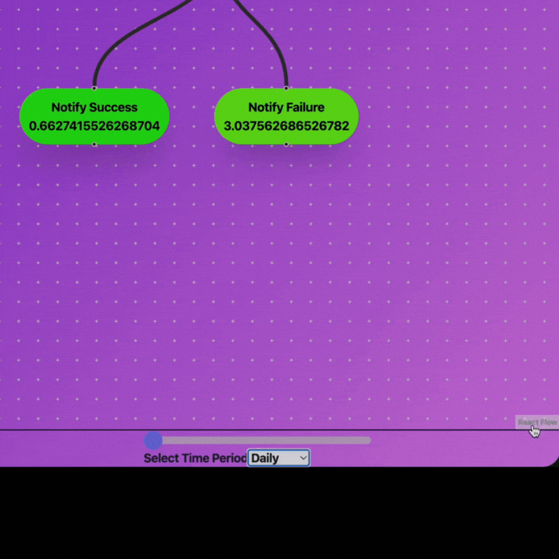
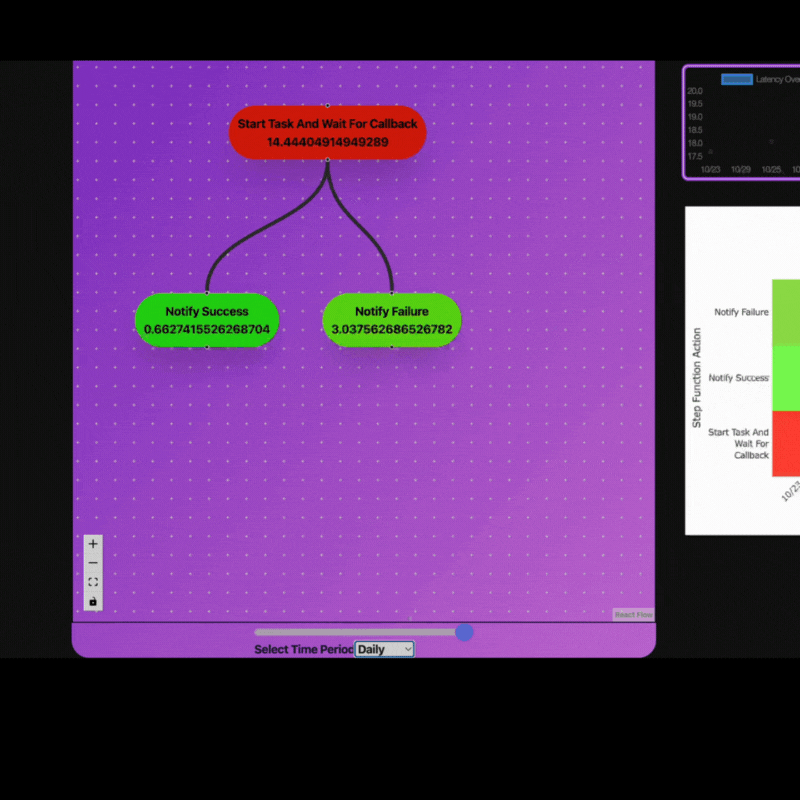
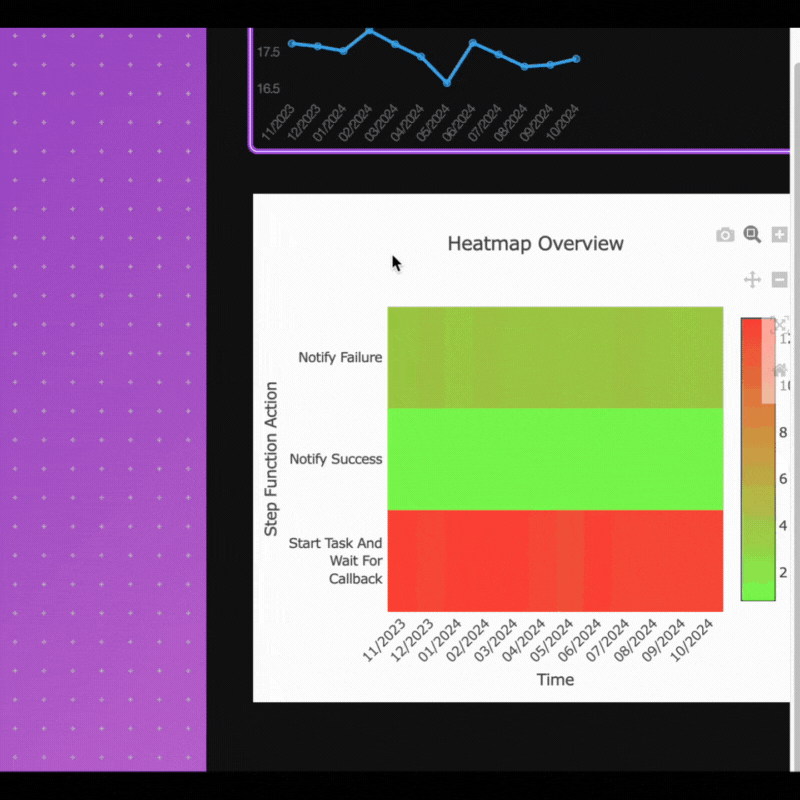

# TimeClimb 

TimeClimb is an app that visualizes AWS Step Function latency averages over custom time ranges (day, week, month, or year), displaying overall step function and individual step latencies. Users can view line charts for time-based latency trends and click on individual steps to see detailed latency metrics on a line chart. A heat map displaying each step's latencies over the selected period of time will display by default.

## Features

### Database

 #### This application is deployed locally on each user's machine using Docker. As long as the user has PostgresDB installed on their machine and has provide the required credentials in a .env file, the program will create a local database in which to store AWS State Machine (Step Function) latency averages.

#### A user will select which State Machine they would like to see latency averages for by providing the State Machine's arn. As long as the correct permissions have been set in AWS for this user (details found in User Setup below) this application will query the database for latency averages for the desired State Machine and display it.

#### A user will select a period of time for which they would like to view their State Machine's latency averages in a drop down. The application will display the following based on the user's input:

  <ul>
    <li>Hours : Will display hourly averages over a 24 hour period</li>
     <li>Days : Will display hourly averages over a 7 day period</li>
      <li>Weeks : Will display hourly averages over a 12 week period</li>
      <li>Months : Will display hourly averages over a 12 month period</li>
  </ul>

#### A user will use a slider to view State Machine averages at certain points within the desired time period 

#### A user may view a line graph of the State Machine's latency averages in a line graph 

#### A user may view the individual Action's (Step's) average latencies in the form of a heat map

#### A user may view a line graph of each Action's average latencies by selecting the desired Action in the display

### Demonstrations 

## Choose a time period 
<p>A user will select a period of time for which they would like to view their State Machine's latency averages in a drop down.
</p>
<p>

</p>

## Select desired hour, day, week or month
<p>Use slider to view latencies at a specific hour, day, week or month.</p>
<p>
</p>

## View individual step latency averages as chart
<p>To view the latency averages for each indivual action (step) as a chart, click on desired action.
</p>
<p>

</p>

## View individual step latency averages on a heat map
<p>To view the latency averages for each indivual action (step) on head map, hover over desired action within desired time period.
</p>
<p>

</p>

## User Setup
 #### Note: See complete example of .env file in .env.example
  ### 1. Insert environment variables to .env file
  ```json
          PGHOST='localhost'
          PGPORT='5432'
          PGUSER='yourUserName'
          PGPASSWORD='yourPassword'  
  ```
  ### 2. Important AWS Information

#### Permissions

  To use this application, a user must be granted certain permissions. Permissions are defined by policies attached to the user directly or through groups in AWS. The following permissions must be granted:
  <ol>
  <li> To pull state machine information from AWS: DescribeStateMachine</li>
  <li> To retrieve execution log data for each step function: read access to FilterLogEvents</li>
  </ol>

#### AWS Pricing

Take note of AWS Pricing associated with the use of this application

<ul>
<li>Log Ingestion: This application uses CloudWatch to retrieve information about your State Machines. For State Machines, ingestion occurs on each execution start and end events as well as one each Step-level event</li>
<li>Log Storage over time: Once logs are ingested into CloudWatch, they incur storage costs over time. Stored data is charged based on the total GB stored. AWS charges $0.50 per GB of data ingested into CloudWatch Logs. AWS provides the first 5 GB of ingested log data per month for free.</li>
<li>Log Data Scanning: This application uses FilteredLogEvents for API calls to AWS which filters log queries- helping reduce costs. Charges are based on the total volume of log data scanned, not the volume of data returned. AWS charges $0.005 per GB of data scanned. AWS offers a free tier covering the first 5 GB of scanned data per month and up to 1 million API requests for free.</li>
<li>Data Transfer Costs: AWS charges $0.09 per GB for data transferred from CloudWatch to your application. The first 100 GB per month of data transfer out is free  </li>
</ul>

#### Note: TimeClimb is not responsible for any incurred cost for using this software. This pricing information is included for convenience and may not be up to date with AWS's current pricing. See links below for detail information:

AWS CloudWatch Pricing: https://aws.amazon.com/cloudwatch/pricing/?nc1=h_ls 

EC2: Data Transwer Pricing: https://aws.amazon.com/ec2/pricing/on-demand/#Data_Transfer 

  ### 3. Insert AWS Access Key and Secret Access Key ###
  ```json
          AWS_ACCESS_KEY_ID=yourAcessKey
          AWS_SECRET_ACCESS_KEY=yourSecretAccessKey
  ```

# Contribution Information:

## Creating and Updating the database time_climb
 #### Note: See complete example of .env file in .env.example
<details>
<summary>1. Create a .env file and insert environment variables to file</summary>

#### Note: Be sure this file is added to your gitignore
Example:
```json
          PGHOST='localhost'
          PGPORT='5432'
          PGUSER='yourUserName'
          PGPASSWORD='yourPassword'  
```
</details>

<details>
<summary>
 2. Insert AWS Access Key and Secret Access Key
</summary>

#### Note: Be sure this file is added to your gitignore

Example:
  ```json
          AWS_ACCESS_KEY_ID=yourAcessKey
          AWS_SECRET_ACCESS_KEY=yourSecretAccessKey
  ```

</details>

<details>
<summary>
 3. Seed dummy data into database
</summary>

#### Note: These migrations will happen through Knex Library https://knexjs.org/. Knex helps to document and automate database schema changes and data migrations over time. This library will also be used for queries made to database in models.

#### Note: If you do not already have PostgresQL on your machine, you will need to download it.

## Once Credentials have been added to example.env:

### Populating with Seed Data

`npm run seed:run` will populate the database with test data. This will erase any existing data you might have in your database.

### Updating database with Seed Data
<code>npm run migrate:latest</code> to update the database with the latest schema.

Updating to the latest migration will typically erase all data in your database
unless the migration script specifically is set up to migrate your data, which
it currently is not.


<details>
<summary> <b>Knex Detailed Usage<b> </summary>
Convenience scripts are set up in package.json to run common knex migration functions.

- `npm run migrate:make` Creating a migration with npm run migrate:make
- `npm run migrate:latest` Updating the database with the latest schema changes
- `npm run migrate:rollback` Rolling back a change to the database

These are partially necessary because both the configuration files and migrations are written in TypeScript. Knex's command line tool does not natively support TypeScript. 

### Creating a migration

Creating a new migration will place a new file in /database/migrations

You can pass the name of the file after the script like so:

`npm run migrate:make -- your_migration_file_name`

### Updatating the database to the latest schema changes

`npm run migrate:latest`

This will update the database with latest schema changes. If necessary its possible to also migrate data so that the data is not lost, which might be especially helpful in a production environment.

### Rolling back a migration

`npm run migrate:rollback`

This will roll back only the very latest migration unit. You can pass in an argument `--all` to rollback all of the completed migrations this way:

`npm run migrate:rollback -- --all`
</details>

</details>

4. Run<code>npm run dev</code>

5. Run<code>npm run dev:server</code> 

## API Documentation
### Base URL
#### **`http://localhost:3000/api`**

All API requests are made to http://localhost:3000/api

### Endpoints for adding/retrieving **Step Functions** to/from database

<details>
<summary>
<code>GET</code><code>/</code>Gets all step functions previously stored in the database
</summary>

#### Parameters

> None

#### Responses
> | http code | content-type                     | response |
> | --------- | -------------------------------- | -------- |
> | `200`     | `application/json;charset=UTF-8` | JSON     |

#### Example Status Code for 200 Ok

```json
[
  {
    "step_function_id": 0,
    "name": "string",
    "description": "string",
    "definition": {}
  }
]
```
</details>

<details>

<summary>
<code>POST</code><code>/step_functions/addStepFunction</code>
Adds a step function to the database
</summary>


#### Parameters

> | name | type     | data type | description                                          |
> | ---- | -------- | --------- | ---------------------------------------------------- |
> | body | required | object    | the arn that corresponds to a specific state machine | |

#### Example Body - JSON

```json
{ "arn": "arn:partition:service:region:account-id:resource-type:resource-id" }
```

### Responses

> | http code | content-type                     | response |
> | --------- | -------------------------------- | -------- |
> | `200`     | `application/json;charset=UTF-8` | JSON     |
> | `400`     | `application/json;charset=UTF-8` | JSON     |
> | `401`     | `application/json;charset=UTF-8` | JSON     |

#### Example Response for 200 Ok: Returns the newly added step function

```json
{
  "step_function_id": 0,
  "name": "string",
  "definition": {}
}
```

</details>
<details>
<summary>
<code>GET</code><code>/step_functions/:step_functions_id/hours</code>
Retrieves <code>hourly</code> average latencies over a span of one <code>day</code> in ascending order
</summary>

#### Parameters

> | name                    | type     | data type |  description                             |
> | ------------------------| -------- | --------- | ---------------------------------------- |
> | `path.step_function_id` | required | string    | The unique ID associated with this step function in database passed in the URL path (`/:step_function_id/hours`) |

#### Example Request
localhost:3000/api/average-latencies/:step_function_id/hours

### Responses

> | http code | content-type                     | response |
> | --------- | -------------------------------- | -------- |
> | `200`     | `application/json;charset=UTF-8` | JSON     |

#### Example Response for 200 Ok
##### Note: If a step function's latencies are not found in database, the elements value in the response will be an empty object
```json
[
 {
        "date": "2024-10-23T04:00:00.000Z",
        "stepFunctionAverageLatency": 18.144353388646543,
        "steps": {
            "Start Task And Wait For Callback": {
                "average": 14.44404914949289
            },
            "Notify Success": {
                "average": 0.6627415526268704
            },
            "Notify Failure": {
                "average": 3.037562686526782
            }
        }
    }
]
```

</details>
<details>
<summary>
<code>GET</code><code>/step_functions/:step_functions_id/days</code>
Retrieves <code>daily</code> average latencies over a span of 7 <code>days</code> in ascending order
</summary>

#### Parameters

> | name                    | type     | data type |  description                             |
> | ------------------------| -------- | --------- | ---------------------------------------- |
> | `path.step_function_id` | required | string    | The unique ID associated with this step function in database passed in the URL path (`/:step_function_id/days`) |

#### Example Request
localhost:3000/api/average-latencies/:step_function_id/days

### Responses

> | http code | content-type                     | response |
> | --------- | -------------------------------- | -------- |
> | `200`     | `application/json;charset=UTF-8` | JSON     |

#### Example Response for 200 Ok
##### Note: If a step function's latencies are not found in database, the elements value in the response will be an empty object
```json
[
 {
        "date": "2024-10-23T04:00:00.000Z",
        "stepFunctionAverageLatency": 18.144353388646543,
        "steps": {
            "Start Task And Wait For Callback": {
                "average": 14.44404914949289
            },
            "Notify Success": {
                "average": 0.6627415526268704
            },
            "Notify Failure": {
                "average": 3.037562686526782
            }
        }
    }
]
```
</details>
<details>
<summary>
<code>GET</code><code>/step_functions/:step_functions_id/weeks</code>
Retrieves <code>weekly</code> average latencies over a span of 12 <code>weeks</code> in ascending order
</summary>

#### Parameters

> | name                    | type     | data type |  description                             |
> | ------------------------| -------- | --------- | ---------------------------------------- |
> | `path.step_function_id` | required | string    | The unique ID associated with this step function in database passed in the URL path (`/:step_function_id/weeks`) |

#### Example Request
localhost:3000/api/average-latencies/:step_function_id/weeks

### Responses

> | http code | content-type                     | response |
> | --------- | -------------------------------- | -------- |
> | `200`     | `application/json;charset=UTF-8` | JSON     |

#### Example Response for 200 Ok
##### Note: If a step function's latencies are not found in database, the elements value in the response will be an empty object
```json
[
 {
        "date": "2024-08-12T04:00:00.000Z",
        "stepFunctionAverageLatency": 18.144353388646543,
        "steps": {
            "Start Task And Wait For Callback": {
                "average": 14.44404914949289
            },
            "Notify Success": {
                "average": 0.6627415526268704
            },
            "Notify Failure": {
                "average": 3.037562686526782
            }
        }
    }
]
```

</details>
<details>
<summary>
<code>GET</code><code>/step_functions/:step_functions_id/months</code>
Retrieves <code>monthly</code> average latencies over a span of 12 <code>months</code> in ascending order
</summary>

#### Parameters

> | name                    | type     | data type |  description                             |
> | ------------------------| -------- | --------- | ---------------------------------------- |
> | `path.step_function_id` | required | string    | The unique ID associated with this step function in database passed in the URL path (`/:step_function_id/months`) |

#### Example Request
localhost:3000/api/average-latencies/:step_function_id/months

### Responses

> | http code | content-type                     | response |
> | --------- | -------------------------------- | -------- |
> | `200`     | `application/json;charset=UTF-8` | JSON     |

#### Example Response for 200 Ok
##### Note: If a step function's latencies are not found in database, the elements value in the response will be an empty object
```json
[
 {
        "date": "2023-11-01T04:00:00.000Z",
        "stepFunctionAverageLatency": 18.144353388646543,
        "steps": {
            "Start Task And Wait For Callback": {
                "average": 14.44404914949289
            },
            "Notify Success": {
                "average": 0.6627415526268704
            },
            "Notify Failure": {
                "average": 3.037562686526782
            }
        }
    }
]
```

## Contributers 
Austin Cheng
Andrew Mott
Paul Uhlenkott
Sharon Patterson
Alex Stewart
<!-- PICK UP HERE -->

