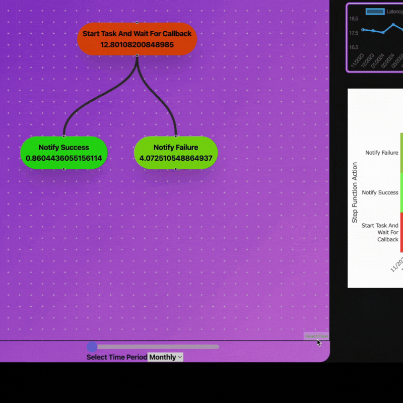

# TimeClimb 

TimeClimb is an app that visualizes AWS Step Function latency averages over custom time ranges (day, week, month, or year), displaying overall step function and individual step latencies. Users can view line charts for time-based latency trends and click on individual steps to see detailed latency metrics on a line chart. A heat map displaying each step's latencies over the selected period of time will display by default.

### Demonstrations 
## Select desired hour, day, week or month
<p>Use slider to view latencies at a specific hour, day, week or month.</p>
<p>
</p>

## View individual step latency averages as chart
<p>To view the latency averages for each indivual action (step) as a chart, click on desired action.
</p>
<p>

</p>

### Setup

## Usage
# API Documentation
## Base URL
### **`http://localhost:3000/api`**

All API requests are be made to http://localhost:3000/api

## Endpoints

### To retrieve **Step Functions** from database

<details>
<summary>
<code>GET</code><code>/step-functions</code>Gets all step functions previously stored in the database
</summary>

#### Parameters

> None

#### Responses
> | http code | content-type                     | response |
> | --------- | -------------------------------- | -------- |
> | `200`     | `application/json;charset=UTF-8` | JSON     |

#### Example Status Code for 200 Ok

```json
[
  {
    "step_function_id": 0,
    "name": "string",
    "description": "string",
    "definition": {}
  }
]
```
</details>

<details>
<summary>
<code>GET</code><code>/step_functions/{step_function_id}
</code> Get the details for a specific step function by it's id - <b>Not Yet Implemented</b>
</summary>

#### Parameters

> | name             | type     | data type    | description |
> | ---------------- | -------- | ------------ | -------------------------------------------- |
> | step_function_id | required | integer > 0  | unique id associated with this step function

#### Responses

> | http code | content-type                     | response |
> | --------- | -------------------------------- | -------- |
> | `200`     | `application/json;charset=UTF-8` | JSON     |
> | `400`     | `application/json;charset=UTF-8` | JSON     |
> | `404`     | `application/json;charset=UTF-8` | JSON     |

#### Example Status Code for: 200 Ok <b>(Not Yet Implemented)</b>

```json
{
  "step_function_id": 0,
  "name": "string",
  "description": "string",
  "definition": {}
}
```

#### Example Status Code for: 400 Invalid Step Function Id

```json
{ "error": "Invalid step_function_id" }
```

#### Example Status Code for: 404 Step Function Not Found

```json
{ "error": "No step function found" }
```

</details>
<summary>
<code>POST</code><code>/step_functions/addStepFunction</code>
<code>Adds a step function to the database</code>
</summary>

#### Parameters

> | name | type     | data type | description                                          |
> | ---- | -------- | --------- | ---------------------------------------------------- |
> | body | required | object    | the arn that corresponds to a specific state machine | |

#### Example Body - JSON

```json
{ "arn": "arn:partition:service:region:account-id:resource-type:resource-id" }
```

### Responses

> | http code | content-type                     | response |
> | --------- | -------------------------------- | -------- |
> | `200`     | `application/json;charset=UTF-8` | JSON     |
> | `400`     | `application/json;charset=UTF-8` | JSON     |
> | `401`     | `application/json;charset=UTF-8` | JSON     |

#### Example Response for 200 Ok: Returns the newly added step function

```json
{
  "step_function_id": 0,
  "name": "string",
  "definition": {}
}
```
#### Example Response for 400 Invalid ARN (Not Yet Implemented):
```json
{ "error": "Invalid arn" }
```

#### Example Response for Unauthorized (Not Yet Implemented):
```json
{ "error": "Unauthorized to access this arn" }
```

<details>


# React + TypeScript + Vite

This template provides a minimal setup to get React working in Vite with HMR and some ESLint rules.

Currently, two official plugins are available:

- [@vitejs/plugin-react](https://github.com/vitejs/vite-plugin-react/blob/main/packages/plugin-react/README.md) uses [Babel](https://babeljs.io/) for Fast Refresh
- [@vitejs/plugin-react-swc](https://github.com/vitejs/vite-plugin-react-swc) uses [SWC](https://swc.rs/) for Fast Refresh

## Expanding the ESLint configuration

If you are developing a production application, we recommend updating the configuration to enable type aware lint rules:

- Configure the top-level `parserOptions` property like this:

```js
export default tseslint.config({
  languageOptions: {
    // other options...
    parserOptions: {
      project: ['./tsconfig.node.json', './tsconfig.app.json'],
      tsconfigRootDir: import.meta.dirname,
    },
  },
})
```

- Replace `tseslint.configs.recommended` to `tseslint.configs.recommendedTypeChecked` or `tseslint.configs.strictTypeChecked`
- Optionally add `...tseslint.configs.stylisticTypeChecked`
- Install [eslint-plugin-react](https://github.com/jsx-eslint/eslint-plugin-react) and update the config:

```js
// eslint.config.js
import react from 'eslint-plugin-react'

export default tseslint.config({
  // Set the react version
  settings: { react: { version: '18.3' } },
  plugins: {
    // Add the react plugin
    react,
  },
  rules: {
    // other rules...
    // Enable its recommended rules
    ...react.configs.recommended.rules,
    ...react.configs['jsx-runtime'].rules,
  },
})
```
